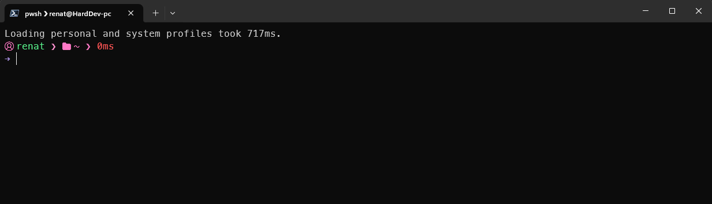
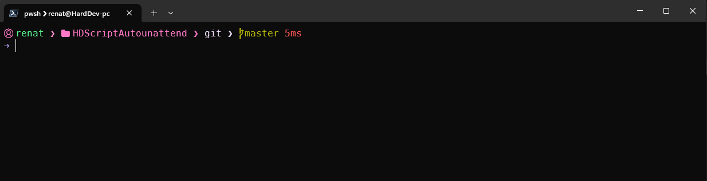

# Autonattend e Script PowerShell 7

Fiz dois scripts usando PowerShell para automatizar a instalação de programas que uso tanto no meu notebook de atendimento externo como no meu pc de trabalho e pessoal.
Cada [autounattend.xml](https://schneegans.de/windows/unattend-generator/) tem configurações distintas, para atender cada uma das minhas necessidades. Abaixo tem um detalhamento do que cada XML e .PS1 faz.

## autounattend-NotHardDev.xml

Principais modificações que eu fiz nesse xml:

- Ignorar a verificação de requisitos do Windows 11 (TPM, Inicialização Segura, etc.)
- Escolha você mesmo o nome do computador: (HardDev-Not) Você pode modificar.
- Versão do windows padrão: Pro
- Permita que a Instalação do Windows crie as seguintes contas locais (“offline”): Usuario HardDev; Senha: 110807
- Sempre mostrar as extensões de arquivo
- Abra o Explorador de Arquivos em Este Computador em vez de Acesso Rápido.
- Exibir o comando "Finalizar tarefa" na barra de tarefas.
- Desativar widgets
- Não mostrar resultados do Bing ao pesquisar no menu Iniciar ou na caixa de pesquisa.
- Desativar o Controle de Conta de Usuário (UAC)
- Impeça que o Windows Update reinicie o seu computador.
- Desativar sugestões de aplicativos / Gerenciador de distribuição de conteúdo
- Tornar o Edge desinstalável (funciona, mas quando o win atualiza o edge volta)
- Excluir C:\Windows.old pasta vazia
- Remova softwares desnecessários. Eu removi quase todos deixei apenas alguns:
  - Câmera
  - Bloco de notas (moderno)
  - PowerShell 2.0
  - WordPad
  - Paint
  - Fotos
  - Windows Media Player (moderno)
  - Calculadora
  - Relógio
  - Terminal do Windows (O script .ps1 instala ele tbem, mas deixei aqui para não ter problemas)

## Scripts executados antes da criação da conta de usuário:

- Mudo o rótulo da unidade C para "sistema"
- Instalo Microsoft Visual C++ Redistributable
- Coloco o esquema de energia Desempenho Máximo
- Desativo a assistência remota do windows

## scripts executados quando o primeiro usuário fizer login após a instalação do Windows

- Instala .Net Framework 3.5
- Por ultimo executo o script SetupNot.ps1

### SetupNot.ps1

Este script configura o terminal do windows, aplicando um tema e configurações especificas para o meu uso. Instala os seguinte programas:

- winget
- PowerShell 7+
- Verifica, instala ou atualiza o Terminal do Windows
- Oh My Posh
- Instala as fontes do Nerd Font. Especificamente a fonte: MesloLG Nerd Font
- Ícones do terminal
- Git
- Posh-git
- AnyDesk
- Google Chrome
- Notepad++
- Teams
- PuTTY
- Lightshot
- 7zip
- Atualizar a Ajuda do PowerShell

#

## autounattend-NotHardDev.xml

Principais modificações que eu fiz nesse xml:

- Escolha você mesmo o nome do computador: HardDev-PC
- Versão do windows: Pro
- Permita que a Instalação do Windows crie as seguintes contas locais (“offline”): Usuario HardDev; Senha: 110807
- Sempre mostrar as extensões de arquivo
- Abra o Explorador de Arquivos em Este Computador em vez de Acesso Rápido.
- Exibir o comando "Finalizar tarefa" na barra de tarefas.
- Desativar widgets
- Não mostrar resultados do Bing ao pesquisar no menu Iniciar ou na caixa de pesquisa.
- Desativar o Controle de Conta de Usuário (UAC)
- Desativar o controle do aplicativo inteligente
- Desative o SmartScreen no Windows e no Edge.
- Permitir a execução de arquivos de script do PowerShell
- Impeça que o Windows Update reinicie o seu computador.
- Excluir C:\Windows.old pasta vazia
- Remova softwares desnecessários. Eu removi quase todos deixei apenas alguns:
  - Câmera
  - Bloco de notas (moderno)
  - PowerShell 2.0
  - WordPad
  - Paint
  - Fotos
  - Windows Media Player (moderno)
  - Calculadora
  - Relógio
  - Loja Microsoft
  - Terminal do Windows (O script .ps1 instala ele tbem, mas deixei aqui para não ter problemas)

## Scripts executados antes da criação da conta de usuário:

- Mudo o rótulo da unidade C para "sistema"
- Instalo Microsoft Visual C++ Redistributable
- Coloco o esquema de energia Desempenho Máximo
- Desativo a assistência remota do windows

## scripts executados quando o primeiro usuário fizer login após a instalação do Windows

- Instala .Net Framework 3.5
- Por ultimo executo o script SetupNot.ps1

### Setup.ps1

Este script configura o terminal do windows, aplicando um tema e configurações especificas para o meu uso, configura e instala o WSL com ubuntu na versão 24. Instala os seguinte programas:

- winget
- PowerShell 7+
- Verifica, instala ou atualiza o Terminal do Windows
- Oh My Posh
- Instala as fontes do Nerd Font. Especificamente a fonte: MesloLG Nerd Font
- Ícones do terminal
- Git
- Posh-git
- AnyDesk
- PowerToys
- Visual Studio Code
- Google Chrome
- Notepad++
- Teams
- DBeaver Community
- Postman
- Brave
- RustDesk
- TortoiseSVN
- TortoiseGit
- WhatsApp
- WhatsApp Beta
- Zoom
- FoxitReader
- Lightshot
- Figma
- 7zip

Após instalar os programas o script habilita o Subsistema do Windows para Linux, define WSL 2 como versão padrão, verifica se tem distros instaladas, instala o Ubuntu-24.04, e define todas as distros como WSL 2.

#

## Visual do terminal

Depois que o script termina, o terminal do windows fica com a seguinte configuração:

- Fonte: MesloLGM Nerd Font
- Size: 12

E fica com o seguinte visual:

E quando o terminal esta trabalhando com o git, o visual fica dessa forma:

No repositório tem o arquivo HardDev.omp.json, é um tema personalizado por mim mesmo, não gosto de muitas informações no terminal, então ele é minimalista e mostra tudo o que eu preciso no dia a dia. Fique à vontade para modificar da forma como você achar melhor.
